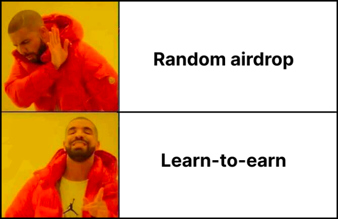

After many months of hard work and sweat, we are thrilled to announce the launch of the DIVA App on the Ropsten testnet. 
The goal of this release is to collect early user feedback to further improve the app ahead of the mainnet launch later this year. 
The best part about all this is that you get rewarded with a claim on the future DIVA token for trying out the app without 
risking real assets 🤯. Read on to find out how to participate.

## What is the DIVA App?

The DIVA App is the first implementation of a web application built on top of [DIVA Protocol](https://docs.divaprotocol.io/), 
a highly customizable and decentralized piece of infrastructure that allows users to create and settle event-linked products 
(so-called “derivatives“). The DIVA App allows users to create and trade a wide variety of derivative products which can 
be used for hedging or betting purposes.

DIVA Protocol’s mission is to empower anyone to bring their betting and insurance product ideas to life in a permissionless way. 
Whether you want to build a prediction markets platform like Augur, a platform selling insurance products to protect against DeFi 
hacks, or create a simple webpage to allow users to bet on the outcome of the Champions League Finals, everything can be realized 
using DIVA Protocol as the underlying technology.

## Learn-to-earn

One of the initiatives that we will be running to coincide with the testnet launch is the **Learn-to-earn program**. 
The goal of this program is to reward users with a claim on the future DIVA token for exploring the functionality offered by the DIVA App 
and providing valuable feedback that will help us to further improve the app ahead of the mainnet launch later this year. 
We believe that this approach is more likely to convert users into long-term believers and supporters compared to a random airdrop model. 
Read about the role of the DIVA token in DIVA Protocol in our [gitbook](https://docs.divaprotocol.io/introduction/diva-token).

The best part about the DIVA testnet is that users are not putting any real assets at risk. All interactions with the DIVA App take 
place on the Ropsten testnet using fake ERC20 tokens and fake ETH.

## How it works

There will be a total of **15 tasks** that users will be asked to complete, each covering one specific functionality of the 
DIVA App (see the list of tasks further down below). Each completed task will earn users 200 points. User’s will 
be able to multiply their score in two ways:
- **1.5x**: Users that complete all tasks will receive an “expert multiple” of 1.5x on their total score resulting in 4500 points.
- **3.0x**: Users that complete all tasks AND hold a whale from our founders’ 888whales.art NFT collection at the time of the DIVA 
token launch event, will receive a “whale multiple” of 3.0x on their total score resulting in 9000 points. 
**Note that holding more than one whale will not give you any additional advantage.**

Each point collected represents a claim on one future DIVA token up to a cap of 1 million DIVA tokens (1% of total supply). 
This means that if the aggregate points collected by all testnet users exceed 1 million, each user’s claim will be cut back pro-rata. 
For example, if the aggregate points collected by testnet users is 2 million, then each point will represent a claim on 0.5 DIVA tokens.

Due to the dependency on the aggregate points collected by testnet users, the final DIVA token rewards will be determined and 
published after the testnet phase. Testnet participants will be able to claim their share of the DIVA token at the token launch event.

## How to participate

Follow the below steps to participate in the DIVA testnet:
- Head over to the [testnet channel](https://discord.gg/ZXpDp9G5b8) in our Discord.
- Type **/register** in the message line, add a **blank space** and paste the **wallet address** that you are going to use to 
interact with the DIVA App and later to claim the DIVA token. It should look as follows:
- _*****image*****_
- Hit Enter to confirm. In addition to the address registration, you will receive fake ERC20 tokens called dUSD 
(address: 0x134e62bd2ee247d4186A1fdbaA9e076cb26c1355) and fake ETH on the Ropsten network that you will need to start 
testing the app. Note that you will not be able to change the address afterwards! Further, note that each verified discord 
user can only register one single account.
- Type **/address** to confirm that your address has been registered. You can also use this command to check which 
account you have registered in case you forget it.
- Type **/claim-test-assets** tokens to receive more dUSD tokens for testing. Note that you can claim test assets once per day. 
Further, note that you will not receive any ETH when running this command.

All available commands to interact with our discord bot are also listed in the testnet channel:
- _*****image*****_

You are now set up to start testing the app which you can access here: [app.diva.finance](app.diva.finance)

### List of tasks

The 15 tasks that testnet users are asked to complete are listed below as well as in the DIVA App under the Testnet Task tab. 
The completion of tasks will be assessed based on logged on-chain events and can be tracked on the Testnet Task page. 
To make things simpler for you, we have created a DIVA App Training in our gitbook that will guide you through the tasks. 
Each task is already linked to the respective section in our gitbook.

|**Task**|**Points**|
|:---|:---|
|**Contingent pool creation**||
|[Create a pool with a binary payoff](https://docs.divaprotocol.io/guides/diva-app-training/create#create-position-tokens-with-a-binary-payoff)|200|
|[Create a pool with a linear payoff](https://docs.divaprotocol.io/guides/diva-app-training/create#create-position-tokens-with-a-linear-payoff)|200|
|[Create a pool with a convex long token payoff](https://docs.divaprotocol.io/guides/diva-app-training/create#create-position-tokens-with-a-convex-long-payoff-concave-short-payoff)|200|
|[Create a pool with a concave long token payoff](https://docs.divaprotocol.io/guides/diva-app-training/create#create-position-tokens-with-a-concave-long-payoff-convex-short-payoff)|200|
|**Adding/removing liquidity**||
|[Add liquidity to an existing pool](https://docs.divaprotocol.io/guides/diva-app-training/add#add-liquidity-to-an-existing-pool)|200|
|[Remove liquidity from an existing pool](https://docs.divaprotocol.io/guides/diva-app-training/remove#remove-liquidity-from-an-existing-pool)|200|
|**Trading**||
|[Create a BUY LIMIT Order that gets filled](https://docs.divaprotocol.io/guides/diva-app-training/trade#create-a-buy-limit-order)[^1]|200|
|[Create a SELL LIMIT Order that gets filled](https://docs.divaprotocol.io/guides/diva-app-training/trade#create-a-sell-limit-order)[^1]|200|
|[Fill a BUY LIMIT order via SELL MARKET](https://docs.divaprotocol.io/guides/diva-app-training/trade#fill-existing-buy-limit-orders-sell-market)|200|
|[Fill a SELL LIMIT order via BUY MARKET](https://docs.divaprotocol.io/guides/diva-app-training/trade#fill-existing-sell-limit-orders-buy-market)|200|
|**Manual settlement**[^2]||
|[Report final value](https://docs.divaprotocol.io/guides/diva-app-training/settle#report-final-value)|200|
|[Challenge a reported value](https://docs.divaprotocol.io/guides/diva-app-training/settle#challenge-a-reported-value)|200|
|**Redemption**||
|[Redeem position token](https://docs.divaprotocol.io/guides/diva-app-training/redeem)|200|
|**Fee claim**||
|[Claim fees as a data provider](https://docs.divaprotocol.io/guides/diva-app-training/fees#claim-fees-as-a-data-provider)|200|
|[Transfer fee claims](https://docs.divaprotocol.io/guides/diva-app-training/fees#transfer-fee-claims)|200|
|**Total**| **3000**|
|**With expert multiple (1.5x)**|**4500**|
|**With whale multiple (3.0x)**|**9000**|

[^1]: It is important to highlight that placing a BUY/SELL LIMIT order is not enough to complete this task. The order has to be filled by 
someone (it can be your own account) in order to be considered complete. The reason for that is that creating a BUY or SELL LIMIT order 
is an off-chain operation. Only the execution of the order triggers an on-chain event that allows us to confirm the completion of the task.
[^2]: Note that the manual reporting process of the final value and the possibility to challenge are only relevant for cases where human 
reporters are used as data providers. In most cases, we expect users to choose oracles that will automatically report the final value 
and do not require their involvement.

The testnet is conducted on the **Ropsten network** and you have time to complete all tasks until **30 September 2022**. 
Details on the timeline for the mainnet launch will be announced after the testnet phase ends.

## Sybil protection

Sybil attacks have become a real problem in the industry. To maximize the token allocation during an airdrop, some individuals or 
organizations create multiple online accounts pretending to be independent and unique users. These so-called Sybil attackers exploit 
the fact that it’s impossible to know who is behind each Ethereum account.

In order to ensure a fair token distribution, it is critical to take precautionary measures to reduce the risk of such attacks. 
The following summarizes the measures that we have taken to prevent such attacks:
- Only verified discord users will be able to register for the testnet. We will retain the freedom to change the definition of a 
“verified” discord user during the testnet.
- Every verified discord user will be able to register one single address.
- Our learn-to-earn program requires users to dig into the documentation and read how to complete the tasks.
- To receive the 3.0x whale multiple, users will have to spend real assets to purchase an 888Whale NFT which sybil attackers 
are unlikely to do. And if they do, those funds will directly flow back into the project.
- The fact that users will earn a claim on the future DIVA token rather than the DIVA token directly, gives us 
additional flexibility to exclude suspicious addresses in hindsight.

We strongly recommend users stay active and visible in our Discord. Ask questions, participate in discussions or provide 
valuable feedback. This will help us to identify users that are here for the right reason. Saying “Hi” or “Gm” may not be enough.

## Final remarks

While most of the functionality is already in place and can be tested, the app is still under development. In particular, 
we are actively working on upgrading the web design as well as improving the performance and responsiveness of the app for a 
better user experience. If data doesn’t refresh automatically, try to reload the page or toggle between tabs.

Also, expect the app to break during the testnet phase. That’s desired behavior and will help us to identify weak points 
and fix them before we launch on mainnet. If you spot any bugs or have proposals on how to further improve the current user experience, 
let us know in our [feedback discord channel](https://discord.gg/NJDm29eEa4). This may earn you some bonus points 😉. Finally, we want to highlight that the current 
version of the app was not optimized for mobile or tablets. We recommend using a desktop computer for the best testing experience.

We hope that you are as excited as we are about the DIVA testnet launch! [Register your wallet in our Discord](https://discord.gg/DE5b8ZeJjK) 
today and give our system a test drive.

## Links

- Website: https://www.divaprotocol.io/ 
- App: https://www.app.diva.finance/
- Twitter: https://twitter.com/divaprotocol_io 
- Discord: https://discord.gg/Pc7UBqxu2b 
- Gitbook: https://docs.divaprotocol.io/ 

